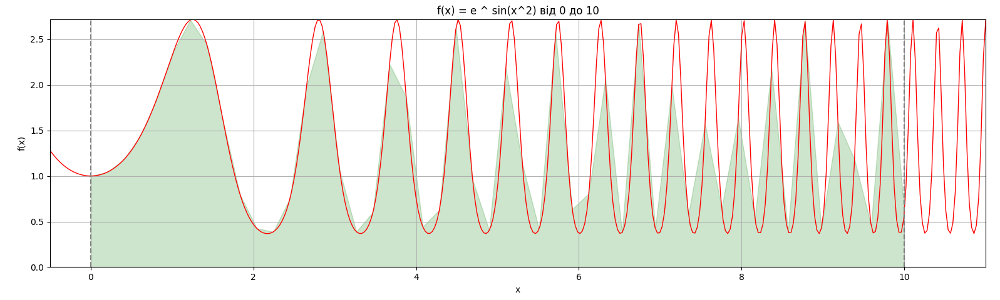
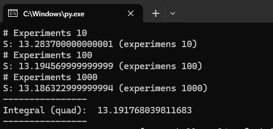

# Task 1

Maximize fruit juice and lemonade production

# Task 2

Test montecarlo to find square under the function e ^ sin( x ^ 2 ) on range from [0, 10]

Run: `.\task_2.py`

## Summary

- amount of experiments could increase the accuracy of the calculation.
- sometimes it's hard to correctly define the logic of how to identify whether dot belongs to square under the function or not